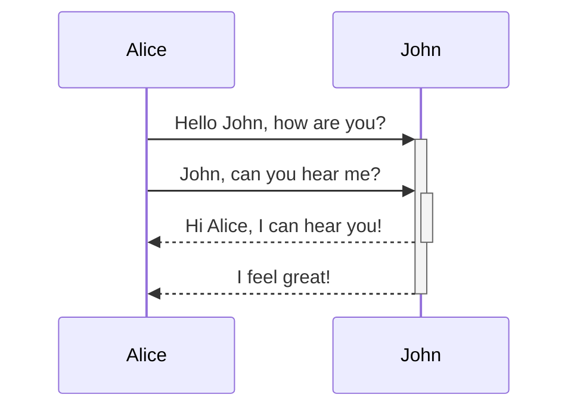
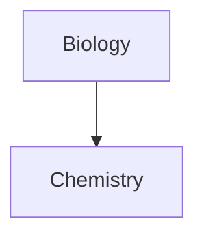

# Tables
|, - 기호로 표를 만들 수 있습니다.

| First name | Last name |
| -- | -- |
| Max | Planck |
| Marie | Curie |

First column | Second column
-- | --
[[Basic\|Markdown syntax]] | ![[og-impage.png\|200]]

Left-aligned text | Center-aligned text | Right-aligned text
:-- | :--: | --:
Left Content | Center Content | Right Content

# Diagram

**Mermaid**를 이용해서 다이어그램을 그릴 수 있습니다.

## Linking files in a diagram

# Math

$$
\begin{vmatrix}a & b\\
c & b
\end{vmatrix}=ad-bc
$$

This is an inline math expression $e^{2i\pi} = 1$.
